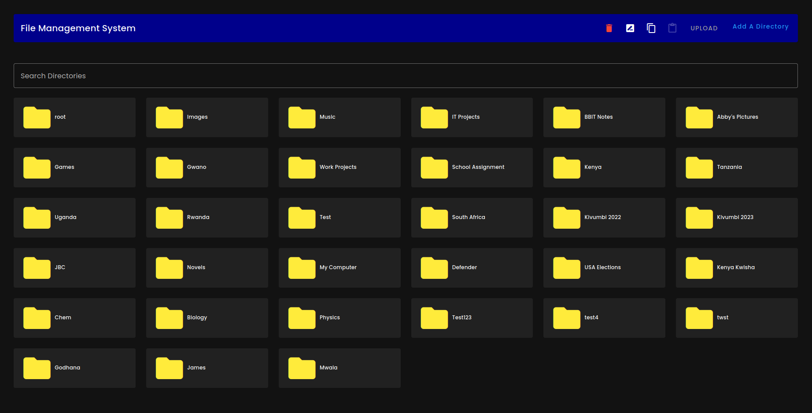

Here's the updated version for a file management system using Vuetify as the foundation:

# File Manager System (Vuetify Template)

This is a customizable scaffolding tool for building a file management system with Vuetify. The template includes a base structure for managing, uploading, and organizing files, and it's configured with all the necessary tools and optimizations to streamline your development process.




## ❗️ Important Links

- 📄 [Vuetify Docs](https://vuetifyjs.com/)
- 🚨 [File Manager System Issues](https://issues.filemanagersystem.com/)
- 🏬 [Store](https://store.filemanagersystem.com/)
- 🎮 [File Manager Playground](https://play.filemanagersystem.com/)
- 💬 [Discord](https://community.filemanagersystem.com)

## 💿 Install

Set up your project using your preferred package manager. Use the corresponding command to install the dependencies:

| Package Manager                                                | Command        |
|---------------------------------------------------------------|----------------|
| [yarn](https://yarnpkg.com/getting-started)                   | `yarn install` |
| [npm](https://docs.npmjs.com/cli/v7/commands/npm-install)     | `npm install`  |
| [pnpm](https://pnpm.io/installation)                          | `pnpm install` |
| [bun](https://bun.sh/#getting-started)                        | `bun install`  |

After completing the installation, your environment is ready to start building your file manager system.

## ✨ Features

- 🖼️ **File Management Front-End Stack**: Built with Vue 3 and Vuetify 3 for a modern and intuitive file management experience. [Vue 3](https://v3.vuejs.org/) | [Vuetify 3](https://vuetifyjs.com/en/)
- 🗃️ **State Management**: Uses [Pinia](https://pinia.vuejs.org/) for modular state management, enabling efficient file handling and metadata storage.
- 🚦 **Routing and Layouts**: Includes Vue Router for navigation and vite-plugin-vue-layouts to structure different sections of the file manager (e.g., folders, uploads). [Vue Router](https://router.vuejs.org/) | [vite-plugin-vue-layouts](https://github.com/JohnCampionJr/vite-plugin-vue-layouts)
- ⚡ **File Upload and Organization**: Supports drag-and-drop file uploading with progress indicators, and provides sorting and filtering options for file organization.
- 📂 **Folder Navigation**: Create and manage folder structures for easy file grouping and navigation.
- 🛠️ **Admin Tools**: Includes admin features like file access control, metadata editing, and advanced search.
- 🧩 **Automated Component Importing**: Automatically imports components as needed using unplugin-vue-components, streamlining your development workflow. [unplugin-vue-components](https://github.com/antfu/unplugin-vue-components)
- 🔐 **File Security**: Integrates role-based access control for files and folders, ensuring secure management of sensitive data.

These features make it easy to manage your file repository, organize documents, images, and other assets while ensuring security and an intuitive user experience.

## 💡 Usage

This section details how to start your file management system and build it for production.

### Starting the Development Server

Run the following command to start the development server. The app will be accessible at [http://localhost:3000](http://localhost:3000):

```bash
npm run dev
```

(Repeat for yarn, pnpm, and bun with respective commands.)

> Use `NODE_OPTIONS='--no-warnings'` to suppress import warnings. If you're on Node [v21.3.0](https://nodejs.org/en/blog/release/v21.3.0) or higher, change it to `NODE_OPTIONS='--disable-warning=5401'`. You can also omit this if you don’t mind the warnings.

### Building for Production

To create a production build, run:

```bash
npm run build
```

(Repeat for yarn, pnpm, and bun with respective commands.)

After the build process, your file manager system will be ready for deployment in a production environment.

## 💪 Support Vuetify Development

Vuetify is an MIT-licensed open-source project, made possible through contributions from its community. Consider supporting the team:

- [Request Enterprise Support](https://support.vuetifyjs.com/)
- [Sponsor John on GitHub](https://github.com/users/johnleider/sponsorship)
- [Sponsor Kael on GitHub](https://github.com/users/kaelwd/sponsorship)
- [Support the Vuetify Team](https://opencollective.com/vuetify)

## 📑 License
[MIT](http://opensource.org/licenses/MIT)

Copyright (c) 2016-present Vuetify, LLC

---

This template provides a robust starting point for developing a file manager system with features like secure file handling, user role management, folder navigation, and modern UI capabilities using Vuetify.